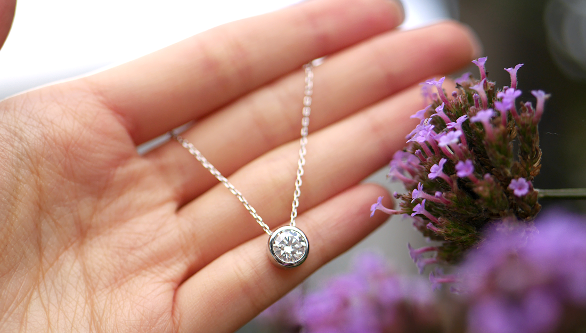

<Spacing size={"sm"} />

Clair: clarity in our gemstones and also in our purpose. We are an ethical and sustainable fine jewellery brand, accessible to all. Minimal but meaningful, our signature collection features our carefully selected moissanite gemstones&mdash;and just like diamonds, a moissanite is forever. 

<Spacing size={"sm"} />

Every moissanite gemstone by Clair comes with a limited lifetime warranty against defects in material or workmanship. Our pieces are set in durable materials such as 925 sterling silver and solid gold, ensuring they last for years to come. 

<Spacing size={"sm"} />

Proud to be a minority- and female-led brand, we hope to empower and celebrate all women. Treating customers fairly is at the heart of everything we do&mdash;this means high quality jewellery, first-rate customer service and fair prices.  

<Spacing size={"sm"} />

## My Story

<Spacing size={"sm"} />

I started Clair as a passion project after struggling to find a diamond alternative that is affordable and kind to the planet. Our moissanite gemstones are ethically sourced, lab-grown and conflict-free. This means no blood diamonds or cartel pricing with our moissanite jewellery. Our products are long-lasting, and we are working hard to reduce our carbon footprint as part of our committment to promoting sustainable and ethical jewellery.

<Spacing size={"sm"} />

The quality of our products is our utmost priority. Unlike jewellery that tarnishes after a few wears, our products are made to last and suitable for daily wear. Every piece we sell is covered by a standard one-year warranty. Part of our promise is to be transparent in sharing our process to learn and improve. 

<Spacing size={"sm"} />

## Our sustainability journey

<Spacing size={"sm"} />

Our mission is to deliver ethical, sustainable and affordable jewellery without hurting the environment. Our products are made to last and we offer a one-year warranty on all our pieces. We use ethically sourced moissanite gemstones and diamond simulants, which are ethical, sustainable and eco-friendly. 

<Spacing size={"sm"} />

In an ongoing effort to be more sustainable, we use enviromentally friendly packaging for our products with minimal plastic use. We plant a tree for every two orders placed to help offset carbon emissions. We are working hard behind the scenes to improve our sustainability practices. 