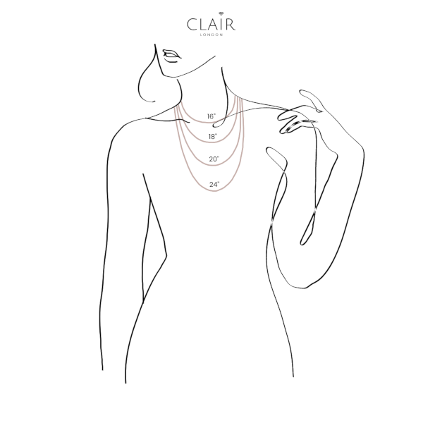

Welcome to our sizing guide. If you are unsure of the size that fits you best or looking for a gift for a loved one, please contact us and we are more than happy to assist you.
<Spacing size="sm" />

<Expandable title={"Rings"}>
<Spacing size="sm" />

| US Size | UK Size | Diameter (mm)| Circumference (mm) | 
|---|---|---|---|
| 4| H 1/2 | 14.9mm | 46.8mm |
| 4.5 | I 1/2 | 15.3mm | 47.8mm|
| 5 | J | 15.7mm| 49.3mm|
| 5.5 | K 1/2 | 16.1mm| 50.6mm|
| 6| L 1/2 | 16.5mm| 51.9mm|
| 6.5 | M 1/2 | 16.9m| 53.1mm |
| 7 | N 1/2 | 17.3m| 54.4mm |
| 7.5 | P | 17.7mm | 55.7mm |
| 8 | Q | 18.1mm | 57.0mm |
| 8.5 | R | 18.5mm | 58.3mm |
| 9 | S | 19.0mm | 59.5mm |
<Spacing size="sm" />

Follow these steps to find your perfect ring size
<Spacing size="sm" />

Using a tape measure, a length of string, ribbon or strip of paper, wrap it around the finger where you will wear your ring on.
<Spacing size="sm" />

Mark the point on the string where it joins with a pen.
<Spacing size="sm" />

Lay your string, ribbon or paper on a flat surface and measure the length. 
<Spacing size="sm" />

Match your measurement to the chart above to identify your Clair London ring size. If you are between sizes, we recommend you to go for the larger size. 
</Expandable>

<Expandable title={"Bracelets"}>

<Spacing size="sm" />

| Size | Wrist circumference (cm) | Length (cm) | 
|---|---|---|
| X-Small | 12-13cm | 14cm | 
| Small | 13-14cm | 15cm | 
| Medium | 14-15cm | 16cm | 
| Large | 15-16cm | 17cm | 
| X-Large | 16-17cm | 18cm | 

<Spacing size="sm" />

Follow these steps to find your perfect bracelet size
<Spacing size="sm" />

Using a tape measure, a length of string, ribbon or strip of paper, wrap it around the wrist where you will wear your bracelet on.
<Spacing size="sm" />

Mark the point on the string where it joins with a pen.
<Spacing size="sm" />

Lay your string, ribbon or paper on a flat surface and measure the length. 
<Spacing size="sm" />

Match your measurement to the chart above to identify your Clair London bracelet size. If you are between sizes, we recommend you to go for the larger size. 

</Expandable>

<Expandable title={"Necklaces"}>
<Spacing size="sm" />

| Length (inches) | Length (cm) | 
|---|---|---|
| 16" | 40.5cm | 
| 18" | 45.8cm | 
| 20" | 50.8cm | 
| 24" | 61.0cm | 

</Expandable>